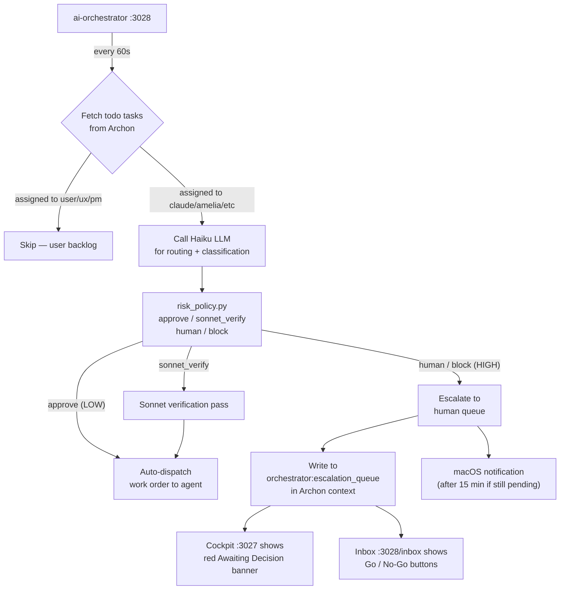
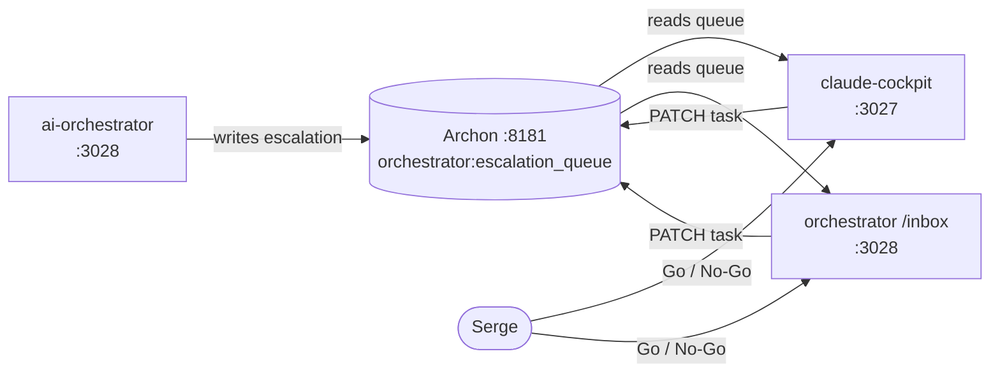
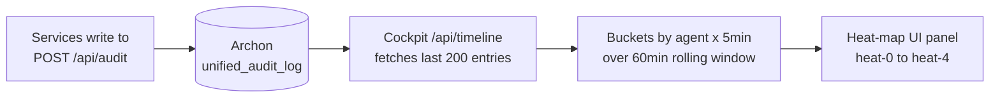
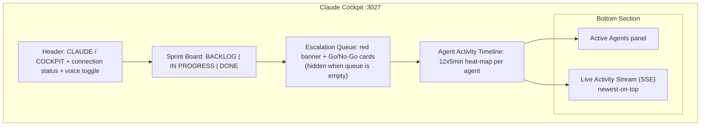
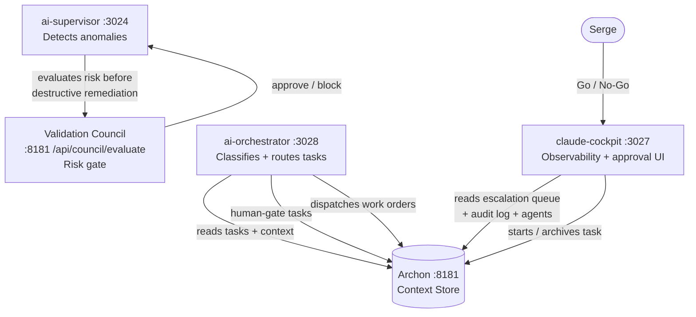
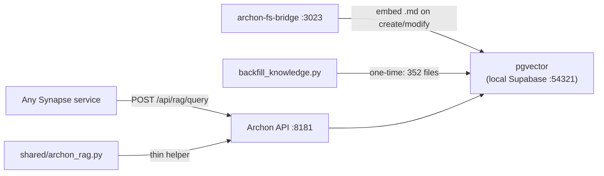

# SYNAPSE — Unified Workspace Platform Architecture
*Produced: 2026-03-22 | Author: Claude (NEXUS) | Status: Implementation-Ready*

---

## Visual Reference Translation

The SYNAPSE visual language (derived from the Cobalt Blueprint standard and SYNAPSE.png) translates into the following hard rules:

### Design Principles
1. **Engineering console, not consumer app.** Every screen should feel like it belongs in a operations center.
2. **Information density with legibility.** Dense but never cluttered. Every pixel earns its place.
3. **Blueprint heritage.** Drafting-paper background with a precise grid is the canvas. Blue is the ink.
4. **Monospace is the voice.** IBM Plex Mono for all data, labels, metadata. IBM Plex Sans only for headlines.
5. **Status over decoration.** Color means state: cobalt = active/selected, amber = warning, red = error, green = success. Never purely decorative.

### Token Guidance
```css
/* SYNAPSE Design Tokens — Full Set */
:root {
  /* Backgrounds */
  --paper:           #f5f0e4;              /* page canvas */
  --paper-white:     #faf8f2;              /* card interior */
  --panel-bg:        rgba(255,255,252,0.88); /* panels with backdrop blur */

  /* Grid overlay — always on body */
  --grid-major:      rgba(30,58,138,0.09);
  --grid-minor:      rgba(30,58,138,0.035);
  --grid-major-size: 60px;
  --grid-minor-size: 12px;

  /* Cobalt — primary accent */
  --cobalt:          #1e3a8a;
  --cobalt-mid:      #2563eb;
  --cobalt-dim:      rgba(30,58,138,0.06);
  --cobalt-bdr:      rgba(30,58,138,0.2);
  --cobalt-bdr-hi:   rgba(30,58,138,0.45);

  /* Status colors */
  --red:             #b91c1c;
  --red-dim:         rgba(185,28,28,0.07);
  --red-bdr:         rgba(185,28,28,0.3);
  --green:           #15803d;
  --green-dim:       rgba(21,128,61,0.07);
  --green-bdr:       rgba(21,128,61,0.3);
  --amber:           #b45309;
  --amber-dim:       rgba(180,83,9,0.07);
  --amber-bdr:       rgba(180,83,9,0.3);
  --violet:          #7c3aed;

  /* Typography */
  --text:            #0d1b2a;
  --text-mid:        #1e3a5f;
  --muted:           #6b7280;
  --muted-light:     #9ca3af;

  /* Fonts */
  --mono: 'IBM Plex Mono', 'Courier New', monospace;
  --sans: 'IBM Plex Sans', -apple-system, sans-serif;

  /* Type scale */
  --font-2xs:  11px;   /* micro-labels, status dots */
  --font-xs:   12px;   /* timestamps, metadata strips */
  --font-sm:   13px;   /* buttons, chips, nav items */
  --font-base: 14px;   /* body text in panels */
  --font-lg:   16px;   /* panel headers */
  --font-xl:   20px;   /* page-level headers */
  --font-2xl:  28px;   /* SYNAPSE identity / hero */

  /* Spacing scale (4px base) */
  --sp-1: 4px;   --sp-2: 8px;   --sp-3: 12px;
  --sp-4: 16px;  --sp-5: 20px;  --sp-6: 24px;
  --sp-8: 32px;  --sp-10: 40px; --sp-12: 48px;

  /* Borders */
  --radius-sm:   4px;
  --radius-md:   8px;
  --radius-lg:   12px;
  --radius-pill: 999px;

  /* No large shadows — schematic feel */
  --shadow-card: 0 1px 3px rgba(30,58,138,0.08);
  --shadow-panel: 0 2px 8px rgba(30,58,138,0.06);
}

body {
  background-color: var(--paper);
  background-image:
    linear-gradient(var(--grid-major) 1px, transparent 1px),
    linear-gradient(90deg, var(--grid-major) 1px, transparent 1px),
    linear-gradient(var(--grid-minor) 1px, transparent 1px),
    linear-gradient(90deg, var(--grid-minor) 1px, transparent 1px);
  background-size: 60px 60px, 60px 60px, 12px 12px, 12px 12px;
  color: var(--text);
  font-family: var(--mono);
}
```

### UI Rules
| Element | Rule |
|---------|------|
| Headings | IBM Plex Sans, bold, dark navy `#0d1b2a` |
| Body / labels | IBM Plex Mono, 13-14px |
| Micro-labels | UPPERCASE, IBM Plex Mono, 10-11px, `--muted` color |
| Borders | `rgba(30,58,138,0.2)` default; `0.45` on hover/active |
| Border radius | max 12px for cards; 4px for inputs/rows; never pill on containers |
| Shadows | Flat. `0 1px 3px rgba(30,58,138,0.08)` only. No elevation drama |
| Motion | 150ms ease. Fade + slight translate. No bounces. No springs |
| Status chips | `--color-dim` background + `--color-bdr` border + `--color` text |
| Buttons | `--cobalt-dim` bg + `--cobalt-bdr` border + `--cobalt` text; hover `--cobalt-dim x2` |
| Tables | Alternating `--paper` / `rgba(30,58,138,0.03)` rows; monospace data cells |
| Panel header | Border-bottom `--cobalt-bdr`, bg `rgba(245,240,228,0.92)` |
| Scroll areas | `overflow-auto` inside panels; never on body |

### Do / Don't
| Do | Don't |
|----|-------|
| Grid on every page background | Solid white backgrounds |
| Cobalt for active states | Green as primary accent (legacy) |
| Monospace for data values | Sans-serif for data cells |
| Tight border radius (4-12px) | Full pill on panel containers |
| Sparse shadows | Drop shadows, layered cards |
| Uppercase micro-labels | Title case for metadata |
| Thin 1px borders | Bold/thick panel borders |
| Minimal, controlled animation | Transitions >200ms on data |

---

# 1. Executive Summary

SYNAPSE is an AI operating system built from 18+ specialized tools that currently run independently. The architecture goal is to unite them under one visual language, one launch mechanism, one context layer, and one event protocol — without rewriting anything.

**The recommended approach:** evolve what exists.

- `workspace-launcher` (:3000) **becomes** the SYNAPSE shell
- `Archon` (:8181) **becomes** the official context broker and event store
- `shared/design-tokens.css` **expands** into the full `@synapse/design-system` package
- A new `Synapse/packages/workspace-sdk/` provides a thin client library for all tools
- A `tool-registry.json` manifest files declares all tools and their capabilities

No framework migration required. Python tools stay Python. React tools stay React. All tools gain caller-awareness via URL params + Archon lookup, and cross-tool communication via Archon event keys.

The result: one product that feels unified, without a big-bang rewrite.

---

# 2. Recommended Default Architecture

```
┌─────────────────────────────────────────────────────┐
│  SYNAPSE Shell  (launcher :3000)                    │
│  ─ Tool grid, launch buttons, session header        │
│  ─ Reads tool-registry.json                         │
│  ─ Injects launch context into Archon before open   │
└──────────────────────┬──────────────────────────────┘
                       │ launch(toolId, intent, entity)
                       ▼
┌─────────────────────────────────────────────────────┐
│  Archon Context Broker  (:8181)                     │
│  ─ Stores: launch:<sessionId> key (TTL 5min)        │
│  ─ Stores: workspace:current, session:active        │
│  ─ Stores: workflow:<service> heartbeats            │
│  ─ SSE endpoint: /api/events/stream (new)           │
└──────────────────────┬──────────────────────────────┘
                       │ context resolved by tool on boot
                       ▼
┌─────────────────────────────────────────────────────┐
│  Tool (any stack)                                   │
│  ─ Reads ?synapse_session=<id> from URL             │
│  ─ Calls GET /api/context/launch:<id>               │
│  ─ Applies theme, renders with caller context       │
│  ─ Publishes events via POST /api/events            │
└─────────────────────────────────────────────────────┘
```

### Components

| Component | What it is | Where it lives |
|-----------|-----------|---------------|
| SYNAPSE Shell | workspace-launcher evolved | `Synapse/launcher/` |
| Context Broker | Archon context API | `Synapse/Archon/` (existing) |
| Event Bus | Archon event keys + SSE stream | Archon extension |
| Design System | CSS tokens + JS primitives | `Synapse/packages/design-system/` |
| Workspace SDK | JS + Python client libs | `Synapse/packages/workspace-sdk/` |
| Tool Registry | JSON manifest + Archon key | `Synapse/tool-registry.json` |
| Context Broker Client | SDK module | included in workspace-sdk |

---

# 3. MVP vs Future-State Architecture

## MVP (Build This First)

**Goal:** One shell, shared design, caller-awareness, minimal event protocol.

| Feature | Approach | Effort |
|---------|---------|--------|
| SYNAPSE shell | Enhance launcher: add tool grid, session header | S |
| Tool registry | `tool-registry.json` + launcher reads it | S |
| Caller awareness | URL param `?synapse_session=ID` + Archon key | M |
| Design system | Expand `shared/design-tokens.css` + migration guide | M |
| Workspace SDK JS | `synapse-sdk.js` — `getLaunchContext()`, `notifyReady()`, `publishEvent()` | M |
| Workspace SDK Python | `synapse_sdk.py` — same interface for Flask tools | M |
| Cross-tool events | POST to Archon context key `event:<type>:<timestamp>` | S |
| Theme adoption | Migrate 4 remaining Python tools via COBALT_BLUEPRINT_STANDARD | M |

**MVP does NOT include:**
- Signed launch tokens (plain Archon lookup is sufficient)
- iFrame embedding (tools open in new tab/window)
- Real-time SSE event stream (polling Archon is fine for MVP)
- MCP tool discovery (manual registry JSON is enough)

## Future-State

| Feature | When | Why |
|---------|------|-----|
| Archon SSE event stream | After 3+ tools emit events | Real-time tool status in shell |
| Signed launch tokens (JWT) | If tools need cross-origin security | Security hardening |
| iFrame embedding mode | When a tool supports it | Unified SPA feel |
| MCP tool capability registration | When AI agents need tool discovery | LLM-tool interop |
| Multi-workspace support | When Serge has multiple active projects | Scale |
| Plugin system (3rd party tools) | Much later | Extensibility |

---

# 4. Tool Integration Contract

Every tool that wants to be SYNAPSE-compatible must implement this minimum contract.

## 4.1 Required Manifest Entry (in `tool-registry.json`)

```json
{
  "id": "workflow-panel",
  "name": "Workflow Panel",
  "description": "Live Archon backlog — sprint board",
  "version": "1.0.0",
  "port": 3019,
  "entry": "http://localhost:3019",
  "icon": "layout-dashboard",
  "launchMode": "tab",
  "stack": "react-docker",
  "themeAware": true,
  "contextAware": true,
  "standaloneSupported": true,
  "capabilities": ["task-management", "sprint-tracking"],
  "healthPath": "/",
  "requiredBy": null
}
```

## 4.2 Required Lifecycle Hooks

On boot, every tool MUST:
1. **Read caller context** — check `?synapse_session` param, fetch from Archon if present
2. **Apply theme** — load Cobalt Blueprint tokens (via CDN link or bundled CSS)
3. **Report ready** — POST `event:tool.ready` to Archon (or SDK `notifyReady()`)

On close/unload:
4. **Report closed** — POST `event:tool.closed`

## 4.3 Required Context Handling

```python
# Python tools — minimum implementation
import os, requests

ARCHON = "http://127.0.0.1:8181"

def get_launch_context(session_id):
    if not session_id:
        return None
    r = requests.get(f"{ARCHON}/api/context/launch:{session_id}", timeout=2)
    return r.json().get("value") if r.ok else None

# In your route handler:
# session_id = request.args.get("synapse_session")
# ctx = get_launch_context(session_id)
# caller = ctx.get("caller") if ctx else "standalone"
```

```javascript
// JS tools — minimum implementation
import { SynapseSDK } from '/synapse-sdk.js'
const sdk = new SynapseSDK()
const ctx = await sdk.getLaunchContext()
```

## 4.4 Required Theme Support

Minimum: Link to `shared/design-tokens.css`.
Full: Override zero tokens — just use the variables as-is.

```html
<link rel="stylesheet" href="http://localhost:3000/static/design-tokens.css">
```

## 4.5 Fallback Behavior (Standalone Mode)

When `?synapse_session` is absent:
- Tool renders normally without caller context
- No Archon calls needed
- Theme still applies (it's just CSS)
- Events are skipped

---

# 5. Caller-Awareness Design

This is the most critical requirement. Here is the full design.

## 5.1 Context Schema

```json
{
  "sessionId": "syn_20260322_abc123",
  "workspaceId": "default",
  "caller": {
    "app": "synapse-shell",
    "page": "tool-grid",
    "component": "tool-card",
    "entityId": "workflow-panel",
    "entityType": "tool"
  },
  "user": {
    "id": "serge",
    "role": "owner"
  },
  "intent": "inspect",
  "launchTimestamp": "2026-03-22T23:40:00Z",
  "returnPath": "http://localhost:3000",
  "ttlSeconds": 300
}
```

## 5.2 Launch Flow (Context Creation)

**Step 1 — SYNAPSE shell generates session ID:**
```javascript
const sessionId = `syn_${Date.now()}_${Math.random().toString(36).slice(2,8)}`
```

**Step 2 — SYNAPSE writes launch context to Archon:**
```bash
PUT http://127.0.0.1:8181/api/context/launch:{sessionId}
{
  "value": { ...context schema above... },
  "set_by": "synapse-shell",
  "ttl_seconds": 300
}
```

**Step 3 — SYNAPSE opens tool with session ID in URL:**
```
http://localhost:3019?synapse_session=syn_20260322_abc123
```

**Step 4 — Tool reads context on boot:**
```javascript
const params = new URLSearchParams(window.location.search)
const sessionId = params.get('synapse_session')
if (sessionId) {
  const resp = await fetch(`http://127.0.0.1:8181/api/context/launch:${sessionId}`)
  const { value: launchCtx } = await resp.json()
  // launchCtx.caller.app === "synapse-shell"
  // launchCtx.intent === "inspect"
}
```

## 5.3 Strong Recommendation: URL Param + Archon Lookup (Not Signed Tokens)

For MVP, use **URL param + Archon lookup**. Reasons:
- Archon is already trusted (local network, no internet exposure)
- Signed tokens add JWT library dependencies across all stacks (Python, JS, Next.js)
- TTL on Archon key provides same replay protection for local use
- Simple to implement in 10 lines in any language

Use **signed JWT tokens** only when:
- Tools are exposed to the internet
- Multiple users with different roles exist
- Context must survive Archon restarts

## 5.4 Secure vs Non-Secure Fields

| Field | Transport | Why |
|-------|-----------|-----|
| sessionId | URL param | Non-sensitive lookup key |
| caller.app, intent, returnPath | Archon value | Not secret, but not in URL |
| user.id, user.role | Archon value | Never in URL |
| entity details | Archon value | May contain internal IDs |

---

# 6. Cross-Tool Communication Model

## 6.1 Recommendation: Archon as Message Bus

Route ALL cross-tool communication through Archon context keys. Reason: Archon is already running, already trusted, already monitored by ai-supervisor. No new infrastructure needed.

## 6.2 Event Key Convention

```
event:<source>:<type>:<timestamp>
```

Examples:
```
event:workflow-panel:tool.ready:1711152600000
event:idea-capture-web:tool.action.completed:1711152601000
event:synapse-shell:tool.request.navigate:1711152602000
```

## 6.3 Event Payload Shape

```json
{
  "source": "workflow-panel",
  "type": "tool.action.completed",
  "sessionId": "syn_20260322_abc123",
  "timestamp": "2026-03-22T23:40:01Z",
  "payload": {
    "action": "task.advanced",
    "taskId": "abc-123",
    "newStatus": "review"
  }
}
```

## 6.4 Standard Event Types

| Event | Direction | Meaning |
|-------|-----------|---------|
| `tool.ready` | tool → shell | Tool has booted and loaded context |
| `tool.opened` | shell → tool | Shell acknowledges tool opened |
| `tool.error` | tool → shell | Tool encountered a blocking error |
| `tool.closed` | tool → shell | Tool window/tab was closed |
| `tool.action.completed` | tool → shell | User completed an action in tool |
| `tool.request.navigate` | tool → shell | Tool requests shell navigate elsewhere |
| `tool.request.open_related` | tool → shell | Tool asks shell to open another tool |
| `tool.context.updated` | tool → shell | Tool's internal state changed (relevant to shell) |

## 6.5 Communication Rule

**Tools do NOT talk directly to each other.** All events route through Archon:

```
Tool A → POST event to Archon → Shell reads event → Shell acts or routes to Tool B
```

This keeps the topology simple and debuggable. The shell is the orchestrator.

## 6.6 MVP Implementation (polling)

Tools poll `GET /api/context?prefix=event:` every 5s to check for new events.
Shell polls same endpoint and processes incoming events.

Future: Add SSE stream endpoint to Archon for push delivery.

## 6.7 Idea Pipeline Data Flow

Ideas auto-captured from Claude sessions (or entered manually in idea-capture-web) create both an **Archon context key** (`capture-api:idea-state:<id>`) AND an **Archon task** (status: `todo`). This dual write ensures ideas surface in both the idea-capture UI and the Idea Flow backlog.

**Relationship:** Idea Flow (:3026) is the idea funnel — it pulls Archon tasks by status (`todo` for Backlog, `doing` for Executing, `done` for Shipped) using targeted status-filtered API calls. Once an idea passes the gate and enters execution, it becomes visible in the Cockpit (:3027) sprint board as an active task. Idea Flow feeds the Cockpit via shared Archon task state.

```
idea-capture-web (:3001/3002)
    │  writes context key + creates Archon task
    ▼
Archon (:8181)  ──  single source of truth
    │
    ├──→ Idea Flow (:3026)     reads tasks by status → funnel board
    └──→ Claude Cockpit (:3027) reads active tasks → sprint board
```

---

# 7. Design System / Theming Strategy

## 7.1 Token Strategy

Single source of truth: `Synapse/packages/design-system/tokens.css`
(Currently exists as `Synapse/shared/design-tokens.css` — expand in place)

All tools import via:
- **Python/HTML tools:** `<link rel="stylesheet" href="http://localhost:3000/static/design-tokens.css">`
- **React/Vite tools:** `import '@synapse/design-system/tokens.css'` (once packageified)
- **Next.js:** `import '../packages/design-system/tokens.css'` in `_app.tsx`

## 7.2 Typography System

```
Headlines:    IBM Plex Sans  Bold/ExtraBold   -- app title, section names
Subheadings:  IBM Plex Sans  SemiBold         -- panel titles, card titles
Body/Data:    IBM Plex Mono  Regular/Medium   -- EVERYTHING else
Micro-labels: IBM Plex Mono  Medium  UPPERCASE 10-11px
```

Google Fonts import (one line, all tools):
```html
<link href="https://fonts.googleapis.com/css2?family=IBM+Plex+Mono:wght@400;500;600&family=IBM+Plex+Sans:wght@400;600;700;800&display=swap" rel="stylesheet">
```

## 7.3 Component Package

The design system ships these primitives as CSS classes + (optionally) React components:

| Component | CSS class | Notes |
|-----------|-----------|-------|
| Panel | `.syn-panel` | `--panel-bg` bg, `--cobalt-bdr` border, `--radius-lg` |
| Panel header | `.syn-panel-header` | Border-bottom, sticky, backdrop-blur |
| Metadata strip | `.syn-meta` | Monospace, `--muted`, `--font-xs`, uppercase |
| Status chip | `.syn-chip .syn-chip--green` etc | Dim bg + border + text |
| Button primary | `.syn-btn` | `--cobalt-dim` bg, cobalt border/text |
| Button ghost | `.syn-btn-ghost` | Transparent bg, cobalt text |
| Data table | `.syn-table` | Alternating rows, monospace cells |
| Badge/dot | `.syn-dot .syn-dot--amber` | 8px circle status indicator |
| Tag/pill | `.syn-tag` | `--radius-pill`, muted style |
| Input | `.syn-input` | `--paper` bg, cobalt focus ring |
| Divider | `.syn-divider` | `--cobalt-bdr` 1px |

## 7.4 Shell Layout Primitives

```
┌──────────────────────────────────────────────────────────┐
│  .syn-shell-header   (sticky, blur, border-b)            │
│  ── logo  ── nav  ── session badge  ── system status    │
├────────────┬─────────────────────────────────────────────┤
│ .syn-sidebar│  .syn-main                                  │
│  (optional) │  ── .syn-page-header                       │
│             │  ── .syn-panel-grid                        │
│             │     ── .syn-panel (repeating)              │
└────────────┴─────────────────────────────────────────────┘
```

## 7.5 Animation Rules

```css
/* All transitions in SYNAPSE */
transition: all 150ms ease;

/* Entrance animations */
@keyframes syn-fade-in {
  from { opacity: 0; transform: translateY(4px); }
  to   { opacity: 1; transform: translateY(0); }
}
```

No bounce. No spring. No delays >150ms. Operators don't like waiting.

## 7.6 Legacy Tool Migration

See `COBALT_BLUEPRINT_STANDARD.md` — already documented. 3 steps:
1. Link `design-tokens.css`
2. Replace green values with cobalt
3. Add IBM Plex Mono

---

# 8. Monorepo / Folder Structure

`~/Documents/Synapse/` IS the monorepo. Formalize it:

```
Synapse/
├── launcher/              ← SYNAPSE shell (port 3000)
├── packages/
│   ├── design-system/     ← tokens.css + component CSS + React primitives
│   ├── workspace-sdk/
│   │   ├── synapse-sdk.js     ← Browser/Node client
│   │   └── synapse_sdk.py     ← Python client
│   ├── tool-registry/     ← registry loader + validation
│   └── event-bus/         ← Archon event client helpers
├── apps/                  ← all tool subdirectories (renamed from current layout)
│   ├── workflow-panel/    (currently: Synapse/workflow-panel/)
│   ├── idea-capture-web/
│   ├── ai-supervisor/
│   ├── claude-dashboard/
│   ├── projects-viewer/
│   ├── archon-client/
│   └── visual-inventory/
├── shared/                ← (existing) design-tokens.css
├── tool-registry.json     ← single manifest for all tools
├── MANIFEST.md            ← human-readable inventory
├── VISION.md
├── README.md
└── SYNAPSE.png            ← visual reference
```

**Why this works:**
- No migration needed — tools stay where they are, just logically grouped under `apps/`
- `packages/` is the new addition — shared code that all tools consume
- `tool-registry.json` is the single source of truth for what tools exist
- shell reads registry at startup, no hardcoded tool lists

---

# 9. Package / Module Breakdown

## `@synapse/design-system`
**Purpose:** CSS tokens, component styles, font references
**Responsibilities:** Define all visual variables; provide `.syn-*` utility classes; ship React components (future)
**Example exports:**
```
tokens.css          — all CSS variables
components.css      — .syn-panel, .syn-btn, .syn-chip, etc.
SynPanel.jsx        — React wrapper (future)
```

## `@synapse/workspace-sdk` (JS)
**Purpose:** Browser/Node client for Synapse shell integration
**Responsibilities:** Read launch context, publish events, get session, request navigation
**Example exports:**
```javascript
export class SynapseSDK {
  async getLaunchContext(): Promise<LaunchContext | null>
  async getCallerInfo(): Promise<CallerInfo | null>
  async notifyReady(): Promise<void>
  async publishEvent(type: string, payload: object): Promise<void>
  async requestNavigation(path: string): Promise<void>
  async requestOpenTool(toolId: string, intent: string, entityId?: string): Promise<void>
  getSession(): SessionInfo
  getTheme(): ThemeTokens
}
```

## `@synapse/workspace-sdk` (Python)
**Purpose:** Same interface for Flask/Python tools
```python
class SynapseSDK:
    def get_launch_context(self, session_id: str) -> dict | None
    def notify_ready(self, session_id: str, tool_id: str) -> None
    def publish_event(self, type: str, payload: dict, session_id: str) -> None
    def get_theme_url(self) -> str  # returns CDN URL for tokens.css
```

## `@synapse/tool-registry`
**Purpose:** Load, validate, and query the tool registry
**Responsibilities:** Parse `tool-registry.json`, expose filtered views (by capability, by status)
**Example exports:**
```javascript
export function loadRegistry(): ToolManifest[]
export function getToolById(id: string): ToolManifest | null
export function getToolsByCapability(cap: string): ToolManifest[]
```

## `@synapse/event-bus`
**Purpose:** Thin wrapper around Archon event keys
**Example exports:**
```javascript
export function publishEvent(type, payload, sessionId)
export function pollEvents(prefix, sinceTimestamp, callback)
export function subscribeToEvents(prefix, callback) // future SSE
```

## `@synapse/context-broker`
**Purpose:** Create and resolve launch contexts
**Responsibilities:** Generate session IDs, write/read Archon launch keys, handle TTL
```javascript
export function createLaunchContext(caller, intent, entityId): Promise<string> // returns sessionId
export function resolveLaunchContext(sessionId): Promise<LaunchContext | null>
```

---

# 10. Example Tool Manifest (`tool-registry.json`)

```json
{
  "version": "1.0.0",
  "tools": [
    {
      "id": "workspace-launcher",
      "name": "SYNAPSE Shell",
      "description": "Central workspace control plane",
      "version": "2.0.0",
      "port": 3000,
      "entry": "http://localhost:3000",
      "icon": "layout-grid",
      "launchMode": "shell",
      "stack": "python-flask",
      "themeAware": true,
      "contextAware": true,
      "standaloneSupported": true,
      "capabilities": ["shell", "navigation", "tool-registry"],
      "healthPath": "/api/status",
      "requiredBy": "all"
    },
    {
      "id": "workflow-panel",
      "name": "Workflow Panel",
      "description": "Live Archon backlog — sprint kanban board",
      "version": "1.0.0",
      "port": 3019,
      "entry": "http://localhost:3019",
      "icon": "layout-dashboard",
      "launchMode": "tab",
      "stack": "react-docker",
      "themeAware": true,
      "contextAware": false,
      "standaloneSupported": true,
      "capabilities": ["task-management", "sprint-tracking"],
      "healthPath": "/",
      "requiredBy": null
    },
    {
      "id": "ai-supervisor",
      "name": "AI Supervisor (PPM)",
      "description": "System health monitor and port authority",
      "version": "3.8.1",
      "port": 3024,
      "entry": "http://localhost:3024",
      "icon": "shield-check",
      "launchMode": "tab",
      "stack": "python-flask",
      "themeAware": false,
      "contextAware": false,
      "standaloneSupported": true,
      "capabilities": ["system-health", "port-management", "anomaly-detection"],
      "healthPath": "/summary",
      "requiredBy": null
    },
    {
      "id": "idea-capture-web",
      "name": "Idea Capture",
      "description": "Capture and manage ideas",
      "version": "1.0.0",
      "port": 3001,
      "entry": "http://localhost:3001",
      "icon": "lightbulb",
      "launchMode": "tab",
      "stack": "react-vite",
      "themeAware": false,
      "contextAware": false,
      "standaloneSupported": true,
      "capabilities": ["idea-management", "capture"],
      "healthPath": "/",
      "requiredBy": null
    }
  ]
}
```

---

# 11. Example Workspace SDK API

## TypeScript Interface

```typescript
interface LaunchContext {
  sessionId:      string
  workspaceId:    string
  caller: {
    app:          string   // "synapse-shell"
    page:         string   // "tool-grid"
    component:    string   // "tool-card"
    entityId:     string   // tool id or task id that triggered launch
    entityType:   string   // "tool" | "task" | "idea" | "project"
  }
  user: {
    id:           string
    role:         string
  }
  intent:         string   // "inspect" | "edit" | "analyze" | "continue" | "create"
  launchTimestamp: string  // ISO 8601
  returnPath:     string   // URL to go back to SYNAPSE
  ttlSeconds:     number
}

interface SynapseSDK {
  // Context
  getLaunchContext():        Promise<LaunchContext | null>
  getCallerInfo():           Promise<LaunchContext['caller'] | null>
  getSession():              { sessionId: string; workspaceId: string }

  // Lifecycle
  notifyReady():             Promise<void>
  notifyError(msg: string):  Promise<void>

  // Events
  publishEvent(
    type: string,
    payload: Record<string, unknown>
  ):                         Promise<void>

  // Navigation
  requestNavigation(path: string):           Promise<void>
  requestOpenTool(
    toolId: string,
    intent: string,
    entityId?: string
  ):                                          Promise<void>
  getReturnPath():           string | null

  // Theme
  getThemeTokens():          Record<string, string>
  injectTheme():             void  // appends design-tokens.css link if not present
}
```

## Minimal JS Implementation (MVP)

```javascript
// Synapse/packages/workspace-sdk/synapse-sdk.js
const ARCHON = 'http://127.0.0.1:8181'

export class SynapseSDK {
  constructor() {
    this._sessionId = new URLSearchParams(window.location.search).get('synapse_session')
    this._context = null
  }

  async getLaunchContext() {
    if (!this._sessionId) return null
    if (this._context) return this._context
    try {
      const r = await fetch(`${ARCHON}/api/context/launch:${this._sessionId}`)
      const d = await r.json()
      this._context = d.value || null
      return this._context
    } catch { return null }
  }

  async notifyReady() {
    await this.publishEvent('tool.ready', { url: window.location.href })
  }

  async publishEvent(type, payload) {
    if (!this._sessionId) return
    const key = `event:${type}:${Date.now()}`
    await fetch(`${ARCHON}/api/context/${encodeURIComponent(key)}`, {
      method: 'PUT',
      headers: { 'Content-Type': 'application/json' },
      body: JSON.stringify({
        value: { type, payload, sessionId: this._sessionId, ts: new Date().toISOString() },
        set_by: window.location.hostname,
        ttl_seconds: 60
      })
    }).catch(() => {})
  }

  getReturnPath() {
    return this._context?.returnPath || 'http://localhost:3000'
  }
}
```

---

# 12. Launch Flow

**Trigger:** User clicks a tool card in SYNAPSE shell.

```
1. USER clicks "Workflow Panel" in shell tool grid
   └─ Shell calls: createLaunchContext(caller, intent='inspect', entityId='workflow-panel')

2. SHELL generates session ID: syn_1711152600_abc123

3. SHELL writes to Archon:
   PUT /api/context/launch:syn_1711152600_abc123
   { caller: { app: "synapse-shell", page: "tool-grid", ... },
     intent: "inspect", user: { id: "serge" }, returnPath: "http://localhost:3000",
     ttl_seconds: 300 }

4. SHELL opens tool:
   window.open("http://localhost:3019?synapse_session=syn_1711152600_abc123")

5. TOOL (workflow-panel) boots:
   └─ index.html loads → React mounts → SynapseSDK initializes

6. SDK reads URL param: synapse_session = syn_1711152600_abc123

7. SDK fetches from Archon:
   GET /api/context/launch:syn_1711152600_abc123
   └─ Returns launch context → stored in sdk._context

8. TOOL applies context:
   └─ Shows "← Back to SYNAPSE" button using returnPath
   └─ Logs caller source for telemetry
   └─ (future: filters data to launchContext.caller.entityId)

9. TOOL calls sdk.notifyReady():
   └─ Writes event:tool.ready:timestamp to Archon

10. SHELL (if polling) sees tool.ready event:
    └─ Updates tool card status to "active"
    └─ Shell can now send follow-up commands if needed
```

---

# 13. Implementation Roadmap

## Phase 1 — Platform Contract (Week 1) ✅ DONE
**Goal:** Define the standards everything is built against.
- [x] Finalize `tool-registry.json` with all tools (21 tools registered)
- [x] Expand `shared/design-tokens.css` into full token set (Cobalt Blueprint)
- [x] Write SDK TypeScript interface — *superseded by `synapse-base` Python app factory*
- [x] Document launch context schema (URL params: synapse_session, synapse_source, etc.)
- [x] Write event naming convention (`workflow:<name>` heartbeats, `system:anomaly:*`, `orchestrator:*`)
**Exit criteria:** ✅ Any developer can read MANIFEST.md + SYNAPSE_ARCHITECTURE.md and integrate.

## Phase 2 — SYNAPSE Shell Foundation (Week 2) ✅ DONE
**Goal:** workspace-launcher becomes a real shell.
- [x] Add tool grid to launcher (service registry with start/stop/restart)
- [x] Add session header bar (workspace name, boot sequence, service count)
- [x] Implement `createLaunchContext()` — *launcher uses direct URL params + Archon*
- [x] Add "open tool" route that writes Archon key + redirects
- [x] Add system status bar (reads ai-supervisor health, Docker status)
**Exit criteria:** ✅ Can click any tool from shell and it opens. Launcher :3000 is the control plane.

## Phase 3 — Shared Packages (Week 2-3) — PARTIAL
**Goal:** SDK is real and usable by at least one tool.
- [ ] Build `synapse-sdk.js` (getLaunchContext, notifyReady, publishEvent) — *not built; JS services use direct Archon calls*
- [x] Build `synapse_sdk.py` (Python equivalent) — *shipped as `synapse-base` with `create_app()`*
- [x] Serve `design-tokens.css` from launcher `/static/` — *Cobalt Blueprint CSS inlined in each service*
- [ ] Package `synapse-sdk.js` as module served from launcher — *not needed yet; all Flask services use synapse-base*
**Exit criteria:** Partial — Python SDK done (`synapse-base`), JS SDK deferred.

## Phase 4 — Pilot Tool Integrations (Week 3-4) — MOSTLY DONE
**Goal:** 4+ tools are fully context-aware and themed.
- [ ] Migrate ai-supervisor to Cobalt Blueprint — *still dark custom theme*
- [x] Migrate claude-dashboard to Cobalt Blueprint
- [x] Add SDK to workflow-panel — *Docker-based, reads Archon directly*
- [x] Add SDK to idea-capture-web — *full Archon integration, audit events, heartbeat*
- [x] Each tool shows caller context — *via Archon context keys, not URL header strip*
**Exit criteria:** Mostly done — 15+ services on Cobalt Blueprint. ai-supervisor is the holdout.

## Phase 5 — Events + Observability (Week 4-5) ✅ DONE
**Goal:** Shell reacts to tool lifecycle events.
- [x] Shell polls Archon for `workflow:*` keys — *launcher + cockpit poll every 3-5s*
- [x] Tool cards in shell show live status (active/idle/error) — *launcher + neural-map*
- [x] Add Archon SSE endpoint for push events — *cockpit + neural-map use SSE*
- [x] Add event log panel to shell — *cockpit Live Activity Stream + agent timeline heat-map*
**Exit criteria:** ✅ Cockpit shows real-time session, neural-map shows system topology, orchestrator logs decisions.

## Phase 6 — Full Rollout (Ongoing)
- Migrate remaining tools
- MCP capability registration (when AI tool discovery is needed)
- Multi-workspace support

---

# 14. Risks and Mitigations

| Risk | Likelihood | Mitigation |
|------|-----------|------------|
| Mixed stacks make SDK hard | HIGH | Build JS + Python clients separately; same interface |
| Theme adoption never completes | HIGH | COBALT_BLUEPRINT_STANDARD + PIXEL migration sprints |
| Context lost after page refresh | MEDIUM | Store sessionId in sessionStorage; re-fetch from Archon |
| Archon becomes a SPOF | MEDIUM | SDK always has fallback (returns null, tool runs standalone) |
| Event sprawl (too many event types) | MEDIUM | Enforce 8 standard event types; reject custom types in code review |
| Docker tools need full rebuild for changes | HIGH (known) | Document rebuild script; FORGE agent owns this |
| Launch context TTL expires | LOW | 5min TTL; tool boots in <30s; non-issue in practice |
| MCP overreach in tool discovery | MEDIUM | MCP stays for AI agents only; tool registry is plain JSON |
| Tool opens before Archon write completes | LOW | Shell awaits Archon PUT before calling window.open() |

---

# 15. Success Criteria

## MVP Done When: ✅ ACHIEVED (2026-04-02)
- [x] All tools visible in SYNAPSE shell tool grid — *launcher :3000 shows 15+ services*
- [x] Every tool can be launched from shell with 1 click — *launcher start/stop/restart per service*
- [x] Launched tools show caller context — *via Archon context keys + synapse-base heartbeat*
- [x] All 15+ tools share Cobalt Blueprint theme (IBM Plex Mono, cobalt colors, grid background)
- [x] Shell shows live health status for all tools — *launcher + neural-map :3031 + cockpit :3027*

## Full Platform Done When: — PARTIAL
- [x] Any new tool can be added by dropping 1 entry in launcher SERVICES + synapse-base `create_app()`
- [x] Shell reacts in real-time when tools open/close/error — *neural-map + cockpit SSE*
- [ ] Tools can request "open related tool" and shell handles routing — *neural-map click-to-open is the start*
- [ ] A developer from outside the project can integrate a new tool in <2 hours using the SDK — *synapse-base makes this possible but untested with external devs*

---

# 16. Strong Recommendation

## Default Architecture
**Archon as context broker + URL params for launch token + polling events (MVP) + SSE (phase 5)**

Do not introduce a separate message bus, a separate state store, or a separate API gateway. Archon already does all of this. Build on it.

## MVP Scope
Build exactly 3 things first:
1. **Tool registry** (`tool-registry.json` + launcher reads it) — 1 day
2. **Launch context** (session ID + Archon key + `?synapse_session` param) — 2 days
3. **JS + Python SDK** (`getLaunchContext`, `notifyReady`, `publishEvent`) — 2 days

Everything else follows from these 3 pieces.

## MCP Recommendation
**Not now for tool discovery. Keep what you have.**

The existing Archon MCP (`:8051`) is valuable for AI agents. Leave it.
For SYNAPSE tool discovery, a plain JSON registry is far simpler and sufficient.
Revisit MCP for tool discovery when you need LLMs to autonomously choose and invoke tools — that's a Phase 6+ problem.

---

# 17. Autonomy Layer — Runtime Architecture

The Autonomy Layer (Pillar 2b in VISION.md) is the operational brain of Synapse. Three services collaborate to classify work, enforce risk policy, present decisions to the human operator, and provide real-time observability over the entire agent workforce.

## 17.1 Components

| Service | Port | Role |
|---------|------|------|
| **ai-orchestrator** | 3028 | Autonomous agent router — classifies tasks, enforces risk policy, dispatches work orders, manages escalation queue |
| **claude-cockpit** | 3027 | Real-time observability + human approval UI — timeline, escalation banner, live activity stream |
| **Validation Council** | 8181 | Risk gate endpoint inside Archon — `POST /api/council/evaluate` returns approve/sonnet_verify/human/block |

## 17.2 The Orchestration Loop

Every 60 seconds, ai-orchestrator reads a snapshot of all Archon tasks and context, then runs each unprocessed item through a two-stage LLM cascade with a deterministic risk gate between them.



Budget is hard-capped at `$2.00/day`. Approximately 95% of decisions stay on Haiku (~$0.0001/call). Sonnet is invoked only when risk_policy requires verification for HIGH-risk items.

## 17.3 Escalation Queue and the Go/No-Go Flow

When the orchestrator determines a task requires human judgment (risk level = `human` or `block`), it does not stall the loop. Instead, it writes a structured escalation item to the persistent Archon key `orchestrator:escalation_queue`.

**Escalation item schema:**
```json
{
  "id": "<uuid>",
  "task_id": "<archon-task-id>",
  "title": "...",
  "reason": "risk=HIGH — requires human approval",
  "suggested_agent": "amelia",
  "created_at": "2026-04-01T14:30:00Z",
  "status": "pending"
}
```

Items are deduped by `task_id` — the same task cannot be escalated twice. Items persist in Archon until the human acts. There is no auto-expiry.

**The human acts through either UI:**

| UI | Route | What Serge Sees |
|----|-------|----------------|
| **Orchestrator Inbox** | `localhost:3028/inbox` | Pending task cards with Go/No-Go buttons + agent picker dropdown |
| **Claude Cockpit** | `localhost:3027` | Red "Awaiting Your Decision (N)" banner at page top, auto-refresh 15s |

**Go** assigns the task to the chosen agent and starts it in Archon (PATCH to task status + assignee). **No-Go** archives the task and removes it from the queue.



If no human acts within 15 minutes, the orchestrator sends a macOS notification and an email to `sergevi@mac.com`.

## 17.4 Agent Activity Timeline (Audit Log to Heat-Map)

The cockpit provides a heat-map timeline that shows which agents were active and when, covering the last 60 minutes in 5-minute buckets. This is the primary tool for understanding workforce distribution at a glance.

**Data pipeline:**



1. Every Synapse service writes structured audit events to Archon's unified audit log (task started, task completed, anomaly detected, etc.)
2. The cockpit's `/api/timeline` endpoint fetches the last 200 audit log entries
3. Entries are bucketed by `agent x 5-minute interval`, producing a 12-column grid per agent
4. Live `workflow:*` agent statuses are merged so that currently active agents appear even if they have no recent audit entries

**Visualization:** Each agent row is a 12-cell heat-map. Cells use Cobalt Blueprint intensity classes: `heat-0` (no activity, dim) through `heat-4` (intense cobalt). The panel auto-refreshes every 30 seconds.

This gives the operator an at-a-glance answer to three questions: which agents are idle, which are overloaded, and whether work is flowing evenly across the team.

## 17.5 Cockpit Layout

The cockpit is a single-page Cobalt Blueprint application that arranges its panels in a top-to-bottom flow:



The escalation banner is deliberately placed high in the layout — directly after the sprint board — so that pending human decisions are impossible to miss. When the queue is empty, the banner collapses and the timeline shifts up.

> **Screenshots:** Cockpit, inbox Go/No-Go, and timeline screenshots should be saved to `Synapse/docs/screenshots/` as `cockpit.png`, `inbox-go-nogo.png`, and `timeline.png` for reference.

## 17.6 How the Three Components Interlock

The Validation Council, Orchestrator, and Cockpit form a closed loop:



**The division of responsibility is clear:**
- The **Validation Council** is the risk gate — it evaluates whether an action should proceed, but does not decide what the action is. The supervisor calls it before killing processes or restarting services.
- The **Orchestrator** is the brain — it reads the full Archon snapshot, classifies tasks via LLM, applies the risk policy, and either dispatches work or escalates to the human. It writes to the escalation queue but does not render UI.
- The **Cockpit** is the eyes and hands — it renders the timeline, the escalation banner, the live activity stream, and the sprint board. It is the primary surface where the human operator approves or rejects escalated work.

Together they ensure that the system can act autonomously on low-risk work while guaranteeing that high-risk decisions always pass through a human gate, with full audit trail and real-time visibility.

---

# Starter Repo Blueprint

## First Folders to Create
```bash
mkdir -p ~/Documents/Synapse/packages/design-system
mkdir -p ~/Documents/Synapse/packages/workspace-sdk
mkdir -p ~/Documents/Synapse/packages/tool-registry
```

## First Files to Write (in order)
```
1. Synapse/tool-registry.json              ← all 18 tools, use manifest from this doc
2. Synapse/packages/design-system/tokens.css  ← expand from shared/design-tokens.css
3. Synapse/packages/workspace-sdk/synapse-sdk.js   ← minimal SDK
4. Synapse/packages/workspace-sdk/synapse_sdk.py   ← Python equivalent
5. Synapse/launcher/templates/tool-grid.html        ← new shell section
6. Synapse/launcher/server.py               ← add /launch/<toolId> route
```

## Implement First
1. `tool-registry.json` — define all tools with health paths and ports
2. Launcher route `GET /api/tools` — returns registry filtered by live health
3. Launcher route `POST /api/launch/<toolId>` — creates Archon context + returns redirect URL
4. `synapse-sdk.js` with `getLaunchContext()` and `notifyReady()`
5. Tool grid in launcher shell (reads `/api/tools`, renders cards)

## Stub / Mock Initially
- Event polling (just write events, don't read them yet)
- Return path / "back" button (hardcode to localhost:3000)
- User identity (hardcode `serge` for now)
- Multi-workspace (everything is `workspaceId: "default"`)

## Defer Until Later
- Signed JWT launch tokens
- Real-time SSE event stream
- iFrame embedding
- Tool capability search / AI-driven tool selection
- Multi-user / multi-workspace
- MCP tool registration

---

# 18. Vector Knowledge Base (v1.3.0)

Added 2026-04-02. Archon now has a semantic knowledge layer backed by pgvector inside local Supabase.

## 18.1 Architecture



## 18.2 Key Decisions

| Decision | Rationale |
|----------|-----------|
| **Local Supabase** over cloud | Cloud Nano tier exhausted at 308K req/day from heartbeats. Local is 2ms, no rate limits, free. |
| **OpenAI text-embedding-3-small** | Best cost/quality ratio for documentation corpus. Key stored in macOS Keychain. |
| **source_id override** in knowledge_api.py | Deterministic re-embed: same file path always overwrites previous embedding, no duplicates. |
| **archon-fs-bridge as embedder** | Already watches all relevant directories. Natural fit — embed on file change event. |

## 18.3 Files

| File | Purpose |
|------|---------|
| `Synapse/archon-fs-bridge/backfill_knowledge.py` | One-time script to embed all existing .md files (~2.3 MB, 352 files) |
| `Synapse/shared/archon_rag.py` | Thin RAG query helper for any service |
| `Synapse/Archon/python/knowledge_api.py` | Archon-side API with `source_id` override for deterministic re-embed |

## 18.4 API Endpoints (on Archon :8181)

| Method | Path | Purpose |
|--------|------|---------|
| POST | `/api/rag/query` | Semantic search -- body: `{"query": "...", "top_k": 5}` |
| GET | `/api/rag/sources` | List all embedded document sources |
| POST | `/api/documents/upload` | Upload and embed a document |

## 18.5 Migration Notes

- Cloud Supabase (`vrxaidusyfpkebjcvpfo.supabase.co`) retired 2026-04-02
- Cloud data fully restored to local: 500 tasks, 45 projects, 21 agents, 266 sessions
- `.env` updated: `SUPABASE_URL=http://host.docker.internal:54321`
- Archon credentials: `EMBEDDING_PROVIDER=openai`, `EMBEDDING_MODEL=text-embedding-3-small`
- OpenAI key renewed and billing activated (was expired/401 since 2026-03-28)
